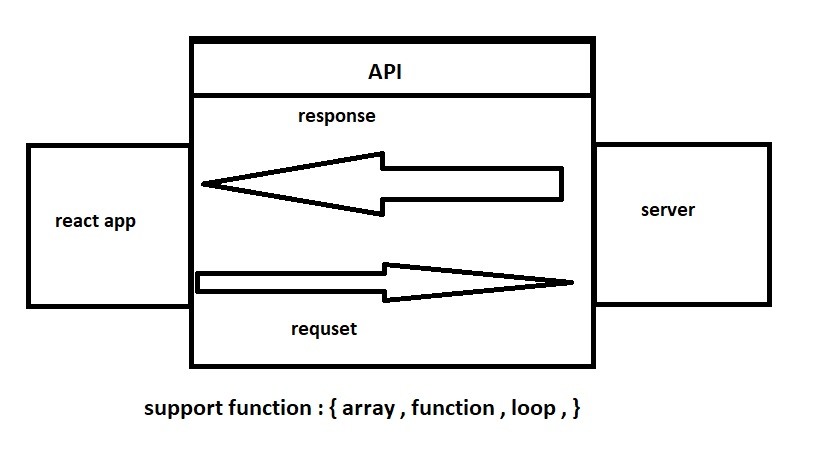

# city explorer 
**Author**: qusai alqaisi 
**Version**: 1.0.0 (increment the patch/fix version number if you make more commits past your first submission)

## Overview
<!-- Provide a high level overview of what this application is and why you are building it, beyond the fact that it's an assignment for this class. (i.e. What's your problem domain?) -->
make the travil maore easy 

## Getting Started
<!-- What are the steps that a user must take in order to build this app on their own machine and get it running? -->
1. make repo.
2. start install npm react 
3. make app.js work .
4. style it 

## Architecture
<!-- Provide a detailed description of the application design. What technologies (languages, libraries, etc) you're using, and any other relevant design information. -->
1. react 
2. node.js
3. JS

## Change Log

29-06-2021 4:59pm - Application now has a fully-functional express server, with a GET route for the location resource.
[city explorer](https://github.com/qusaiqeisi/city-explorer)

## Credit and Collaborations
<!-- Give credit (and a link) to other people or resources that helped you build this application. -->

[city explorer](https://github.com/qusaiqeisi/city-explorer)

Name of feature: __________Asynchronous code, and APIs______________________

Estimate of time needed to complete: ___4 hour __

Start time: __2:30___

Finish time: __6:30___

Actual time needed to complete: ___4__

///////////////////////////////////////////////////////////////

Name of feature: __________Asynchronous code, and APIs 2______________________

Estimate of time needed to complete: ___4 hour __

Start time: __3___

Finish time: __4___

Actual time needed to complete: ___1__

